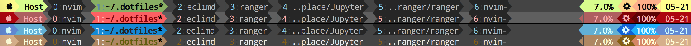

# Dustline Tmux Colorscheme Plugin
Tmux Powerline/Airline Style Color Scheme. Native and simple.

and


## Why
* Status bar highlight when you press prefix
* More colors
* New colorschemes and more coming soon!

## Prerequisite 
* tmux and [TPM](https://github.com/tmux-plugins/tpm) (tmux version >=1.9 )
* bash
* Powerfont or Nerdfont (Optional)

## Install 
With tmux plugin manager (TPM) 
```sh
set -g @plugin 'daizeng1984/tmux-dustline'
```

## Example in your .tmux.conf
 
```bash
set -g @dustline_scheme_file "wombat.tmux" # Set your color scheme file
```

You can then set status line with as many plugins icons as you like to either left or right status bar

```sh
set -g status-left '#{dustline_scheme_begin}'\
'#[bold]  '\
'#{dustline_scheme_separator}'\
' Host'\
'#{dustline_scheme_end}'

set -g status-right '#{dustline_scheme_begin}'\
'#[bold]CPU:#{cpu_percentage}'\
'#{dustline_scheme_separator}'\
'#{battery_percentage}'\
'#{dustline_scheme_separator}'\
' %m-%d'\
'#{dustline_scheme_end}'
```

## Customize Your Own Colorscheme
See wombat.tmux example under ./colorscheme

## License
[MIT](./LICENSE.md)
